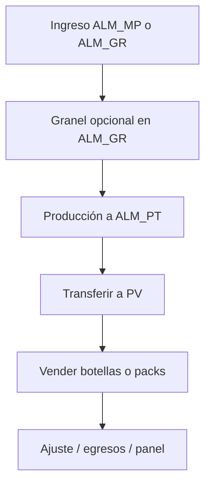

# Resumen general — Web ERP Bodega Santa María

**VIZIA S.A.C.** · Bodega Santa María · 2026  
**Versión del sistema web:** 1.0.0  
**Público:** dirección, gerencia y personal operativo  
**Última actualización:** 25 julio 2026

---

## 1. ¿Qué es el sistema web?

El **ERP web de Bodega Santa María** es el panel operativo en el navegador para inventario, producción, ventas, egresos y consulta gerencial. Comparte la **misma base de datos en la nube** que la aplicación móvil: lo registrado en un canal se refleja en el otro.

Desarrollado y entregado por **VIZIA S.A.C.** Acceso por correo y contraseña; despliegue en **Cloudflare Pages**.

---

## 2. Dos reglas de oro

### 2.1 Un SKU = botellas

El producto terminado se inventaría en **botellas** (`item_id`). Pack ×6 / ×12 solo cambia cómo se cuenta o vende.

| Entrada en pantalla | Inventario |
|---------------------|------------|
| 10 packs ×6 | **60 botellas** |
| 5 packs ×12 | **60 botellas** |
| 60 botellas | **60 botellas** |

### 2.2 Cada almacén = una familia de materiales

| Almacén | Solo admite |
|---------|-------------|
| **ALM_GR** | Granel (litros) |
| **ALM_MP** | Material, insumo y empaque |
| **ALM_PT** | Producto terminado (botellas) |
| **PV_*** | Producto terminado (botellas) |
| **TRANSIT** | Solo sistema (transferencias); no se elige a mano |

La web filtra los desplegables y Supabase **rechaza** movimientos incorrectos.

---

## 3. Qué resuelve

| Necesidad | Cómo lo cubre el web |
|-----------|----------------------|
| Ver el mes | Panel de control por pestañas |
| Stock por almacén | Inventario + ajuste con filtro de tipo según ubicación |
| Comprar sin mezclar almacenes | Ingreso solo a ALM_MP o ALM_GR |
| Embotellar | Producción → destino ALM_PT |
| Vender en botellas aunque haya entrado como pack | Ingresos / Despacho por SKU |
| Ajustar en el PV | Ajuste de inventario en puntos de venta |
| Corregir errores | Modificaciones (ventas y egresos / anular compra) |
| Mover stock | Transferencias sin TRANSIT manual; valida origen/destino |
| Exportar | Descargas Excel por mes |
| Catálogos | Materiales/SKUs, maestros, clientes y proveedores (admin) |

---

## 4. Módulos en una mirada

| Módulo | Para qué sirve |
|--------|----------------|
| **Panel de control** | Resumen del mes |
| **Inventario** | Stock; ajuste por almacén + tipo permitido |
| **Ingreso Insumos** | Compras a ALM_MP o ALM_GR |
| **Transferencias** | Entre almacenes/PV (sin TRANSIT) |
| **Recetas** | BOM por 1 botella |
| **Granel** | Alta de litros en ALM_GR |
| **Producción** | Órdenes SKU → ALM_PT |
| **Reempaque** | Ítem→ítem en ALM_MP / ALM_GR / ALM_PT |
| **Ingresos** | POS multi-línea o rápida |
| **Despacho** | Venta de una línea |
| **Egresos** | Gastos del día |
| **Modificaciones** | Corregir/anular ventas y egresos |
| **Clientes y proveedores** | Catálogo (admin) |
| **Auditoría** | Historial y lotes |
| **Descargas** | Excel |
| **Materiales / SKUs** | Ítems y presentaciones (admin) |
| **Maestros** | Canales, empaques, categorías gasto (admin) |
| **Usuarios** | Consulta (solo lectura) |
| **Reportes** | Resumen del periodo (admin) |
| **Configuración** | Preferencias y cerrar sesión |

**Menú:** Panel → Inventario → Producción → Comercial → Consulta → Administración.

---

## 5. Beneficios

1. Una sola verdad de stock (misma BD que la app).
2. PT siempre en botellas; packs solo convierten.
3. Almacenes no se mezclan (UI + Supabase).
4. Venta flexible en botellas aunque el ingreso haya sido en packs.
5. Ajuste de conteo en almacén o PV.
6. Corrección segura con Modificaciones.
7. Panel gerencial y descargas.
8. Sesión estable en el navegador.

---

## 6. Quién usa qué

| Perfil | Acceso |
|--------|--------|
| Sin acceso web | No inicia sesión |
| Acceso web, sin ventas | Bodega / producción / consulta |
| Acceso web + ventas | También Ingresos, Despacho, Egresos, Modificaciones |
| Admin | Además catálogos, usuarios, reportes |

---

## 7. Relación con la app móvil

Misma Supabase. Use web u app según el contexto; **no duplique** la misma operación en ambos.

---

## 8. Plataforma

React 19 + TypeScript + Vite · Supabase · Cloudflare Pages · Documentación VIZIA S.A.C.

---

## 9. Documentos relacionados

| Documento | Uso |
|-----------|-----|
| Manual de uso web (PDF) | Operación día a día |
| Resumen técnico web (PDF) | Arquitectura, RPC, política almacén |

Soporte: Bodega Santa María / **VIZIA S.A.C.**

---

*VIZIA S.A.C. · Bodega Santa María · Resumen general Web v1.0.0 · Julio 2026*
