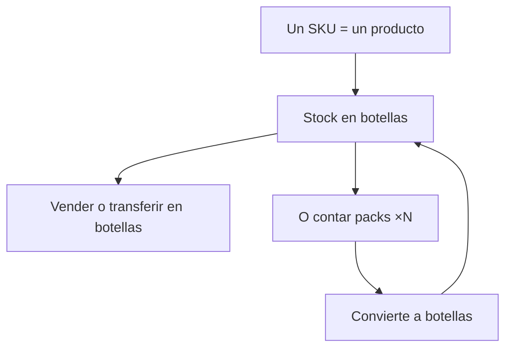
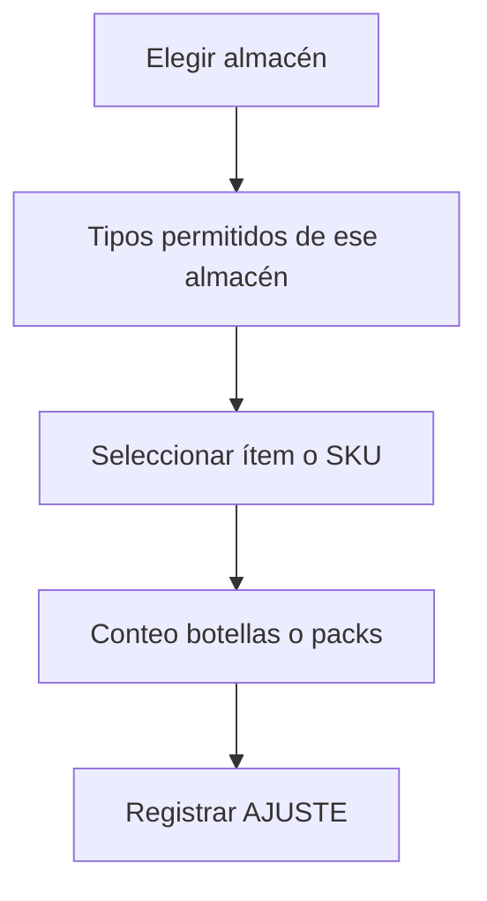
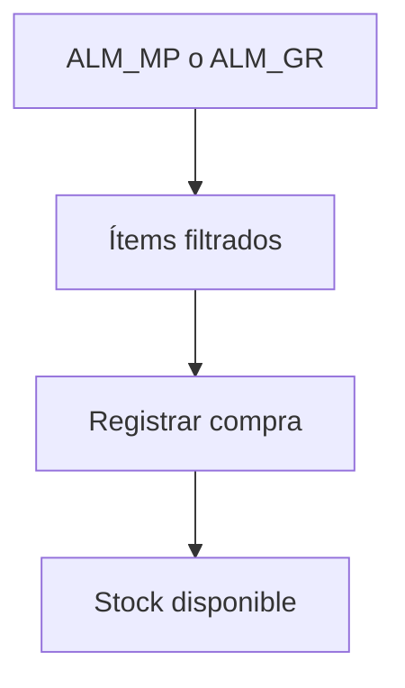
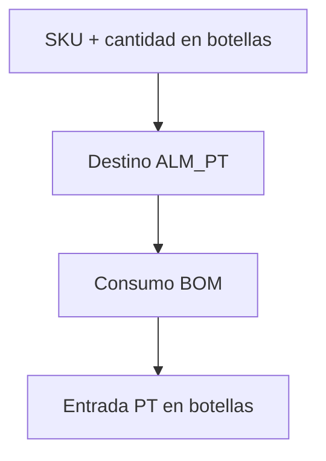
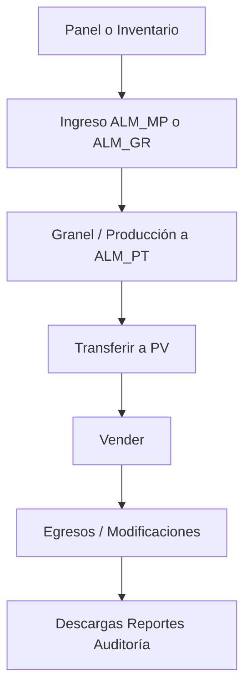

# Manual de uso detallado — Web ERP Bodega Santa María

**VIZIA S.A.C.** · Bodega Santa María · 2026  
**Versión del sistema web:** 1.0.0  
**Público:** personal de bodega, producción, punto de venta y administración  
**Última actualización:** 25 julio 2026

Este manual describe el uso día a día del **ERP web**. Los nombres coinciden con el menú lateral.

**Secciones:** Panel de control · Inventario · Producción · Comercial · Consulta · Administración.

---

## 1. Acceso e inicio de sesión

1. Abra la URL del sistema.
2. Ingrese **correo** y **contraseña**.
3. Pulse **Iniciar sesión**.
4. Verá el **Panel de control** y el menú lateral.

### Sesión

- Se renueva sola mientras la pestaña esté abierta.
- En equipos compartidos: **Configuración → Cerrar sesión**.

### Si no puede entrar

- Revise mayúsculas; confirme **acceso web**; use Chrome, Edge o Firefox actualizado.

---

## 2. Unidades, SKU, packs y almacenes

### Unidades

| Qué | En pantalla | En inventario |
|-----|-------------|---------------|
| Producto terminado | Botella o pack ×6 / ×12… | Siempre **botellas** |
| Material / insumo / empaque | Su unidad | Esa unidad |
| Granel | Litros | Litros en ALM_GR |

**Ejemplos:** 10 × pack×6 = 60 botellas · 5 × pack×12 = 60 botellas · 60 botellas = 60 botellas.

### Política de almacenes (obligatoria)

| Código | Solo admite | Cómo entra el stock |
|--------|-------------|---------------------|
| **ALM_MP** | Material, Insumo, Empaque | Ingreso de insumos |
| **ALM_GR** | Granel | Ingreso o módulo Granel |
| **ALM_PT** | Producto terminado | Producción |
| **PV_*** | Producto terminado | Transferencia desde PT / ajuste |
| **TRANSIT** | — | Solo el sistema en transferencias |

Los desplegables **solo muestran** lo permitido. Si se fuerza un movimiento incorrecto, Supabase lo rechaza.

---

## 3. Permisos

| Permiso | Efecto |
|---------|--------|
| Sin acceso web | No inicia sesión |
| Acceso web, sin ventas | Sin Ingresos, Despacho, Egresos ni Modificaciones |
| Acceso web + ventas | También módulos comerciales |
| Admin | Materiales/SKUs, Maestros, Usuarios, Reportes, Clientes y proveedores |

Varios módulos tienen ícono de **ayuda**.

---

## 4. Panel de control

1. Elija el **mes**.
2. Pestañas: Ejecutivo, Financiero, Operaciones, Comercial, Producción, Inventario.
3. Atajo a **Descargas** si necesita Excel.

Ventas anuladas no suman. Zona: **America/Lima**.

---

## 5. Inventario

### Resumen

Filtre por ubicación, tipo, categoría o alertas de mínimo. PT se muestra en botellas.

### Ajuste / conteo

1. Pestaña **Ajuste / conteo**.
2. Elija **almacén / ubicación** (ALM_MP, ALM_GR, ALM_PT o PV).
3. El filtro **Tipo de material** solo lista tipos de ese almacén.
4. Seleccione ítem/SKU (incluye sin stock para sembrar).
5. En PT: Botellas o Packs ×N.
6. Indique conteo → el sistema calcula el delta → confirme.

**Ejemplos**

- ALM_MP → solo material/insumo/empaque.
- ALM_GR → solo granel.
- ALM_PT o PV → solo PT en botellas.
- PV con faltante de 3 botellas → ajuste de salida −3.

---

## 6. Ingreso de insumos (compras)

Solo destinos **ALM_MP** o **ALM_GR**. El PT **no** se compra aquí (sale de Producción).

1. Elija almacén destino.
2. Verá solo ítems compatibles (y filtro de tipo acorde).
3. Cantidad, precio, referencia; egreso opcional.
4. Modo documento: varias líneas del **mismo** almacén.

Si activa egreso: se crea gasto origen COMPRA. Corrija en **Modificaciones → Egresos**.

---

## 7. Transferencias

1. Origen y destino (sin TRANSIT).
2. Pestaña PT o Material.
3. Los ítems se filtran según lo que admite el **origen**.
4. Origen y destino deben admitir el mismo tipo (ej. granel solo entre ubicaciones de granel; PT entre ALM_PT/PV).
5. Envíe → EN_TRANSITO → **Recibir** en destino.

**Ejemplo:** 5 packs ×12 (= 60 bot.) de ALM_PT a PV → recibir en el PV.

---

## 8. Recetas

BOM por **1 botella**. Granel se consume de ALM_GR; el resto de ALM_MP. Alta/edición: admin.

---

## 9. Granel

Alta de litros en **ALM_GR**. Requiere ítems tipo GRANEL y ubicación ALM_GR configurada.

---

## 10. Producción (envasado)

1. Elija **SKU** (un producto).
2. Planifique en botellas o packs (la orden guarda botellas).
3. Destino obligatorio: **ALM_PT**.
4. Valide insumos → cree BORRADOR → complete con cantidad real en botellas.

---

## 11. Reempaque

Convierte un ítem en otro en **ALM_MP, ALM_GR o ALM_PT** (no PV ni TRANSIT).

No use reempaque solo para “cambiar pack×6 por pack×8”: el stock PT ya está en botellas.

---

## 12. Ingresos (POS)

Requiere **acceso ventas**.

- PV, canal, cliente opcional.
- Un producto = un SKU; luego botellas o packs ×N.
- Baja siempre en **botellas** (FIFO si no elige lote).
- Venta nueva = fecha de hoy (Lima).

Modos: **agrupada** (carrito) o **rápida** (una línea).

**Ejemplo:** tiene 60 botellas (entraron como packs) → puede vender 15 botellas sueltas.

Errores: **Modificaciones → Ingresos**.

---

## 13. Despacho

Una línea (mostrador/delivery). Misma lógica de SKU/botellas que Ingresos. Lote opcional.

---

## 14. Egresos

Gastos que **no** nacen de una compra de insumos. Orígenes Manual o Compra. Corrija en Modificaciones.

---

## 15. Modificaciones

### Ingresos (ventas)

Edite precios/cliente/canal; **anular** restituye stock. No cambia cantidades ni ubicación.

### Egresos

- Manual: editar o eliminar.
- Compra: editar monto/datos; **eliminar** anula la compra (revierte stock si el lote aún tiene saldo).

---

## 16. Clientes y proveedores (admin)

Alta / edición / baja lógica. Solo activos en desplegables de operación.

---

## 17. Auditoría

Historial de movimientos y trazabilidad por lote.

---

## 18. Descargas

Excel por mes y módulo.

---

## 19. Materiales / SKUs (admin)

Ítems y presentaciones (botella `cant_unidades=1`, pack ×6 / ×12…). Crear presentación **no** genera stock.

---

## 20. Maestros (admin)

Canales, empaques, categorías de gasto. Tras cambios: **Configuración → recargar catálogos**.

---

## 21. Usuarios (admin)

Solo lectura de cuentas y flags.

---

## 22. Reportes (admin)

Resumen de ventas, gastos, producción y compras por rango.

---

## 23. Configuración

Cuenta, preferencias, recargar catálogos, cerrar sesión.

---

## 24. Mensajes de confirmación y errores

Tras **guardar o registrar** con éxito, la pantalla muestra una alerta verde con un mensaje fijo:

| Acción | Mensaje |
|--------|---------|
| Compra, ingreso, despacho, ajuste, producción, granel, reempaque, transferencia, egreso | **Registrado correctamente** |
| Recepción de transferencia | **Recibido correctamente** |
| Guardar catálogo (materiales, maestros, recetas, partners) | **Guardado correctamente** / **Actualizado correctamente** |
| Anular venta o compra | **Anulado correctamente** |
| Eliminar línea / egreso | **Eliminado correctamente** |

Los mensajes aparecen en una **ventana emergente** centrada (no arriba de la página), con botón **Entendido**. El éxito se cierra solo a los pocos segundos.

- Si la operación **falla**, el formulario **conserva** lo que escribió y aparece el mismo popup en rojo.
- Si tiene éxito, se **limpian** los campos de captura (se mantienen ubicación / PV / canal por comodidad).

### Mensajes frecuentes

| Situación | Qué hacer |
|-----------|-----------|
| Sin ítems en el desplegable | Cambió de almacén: solo se listan tipos permitidos |
| Error “ALM_MP solo INSUMO…” | Elija el almacén correcto para ese material |
| Sin stock en PV | Transfiera desde ALM_PT o ajuste en el PV |
| Quiero vender botellas sueltas | Use modo **Botellas** |
| Producto en 0 botellas | Puede verlo en el listado; no podrá vender hasta reponer stock |
| Falta ALM_PT / ALM_GR | Configure ubicaciones en catálogo |
| No se anula compra | El lote ya tiene salidas; revise auditoría |

---

## 25. Flujo típico del día

---

## 26. Buenas prácticas

- No duplique operaciones entre web y app.
- Prefiera Modificaciones antes de “compensar” con otra captura.
- Respete almacén ↔ tipo; el sistema lo exige.
- En PT piense en botellas.
- Cierre sesión en equipos compartidos.

---

## 27. Soporte

Anote mensaje, módulo y hora. Contacte Bodega Santa María / **VIZIA S.A.C.**  
Técnico: **Resumen técnico web**.

---

*VIZIA S.A.C. · Bodega Santa María · Manual de usuario Web v1.0.0 · Julio 2026*
