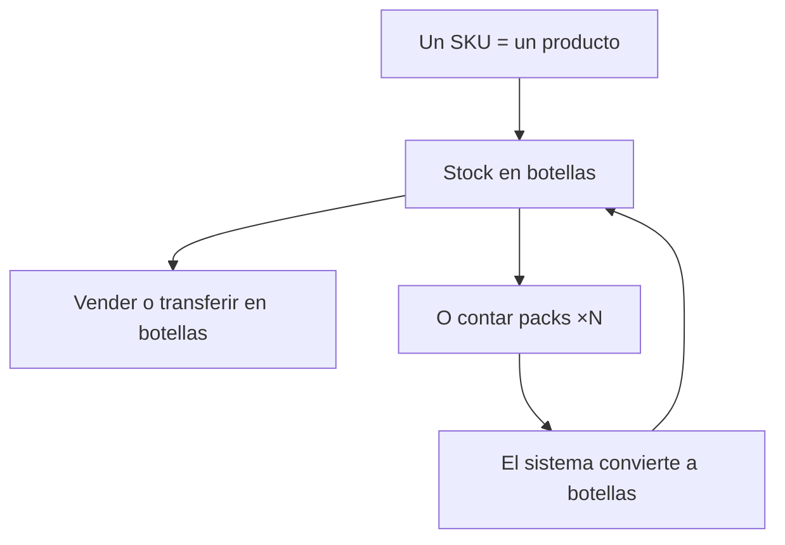
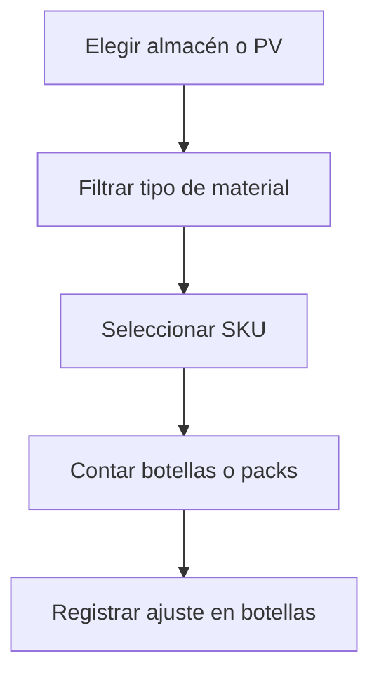
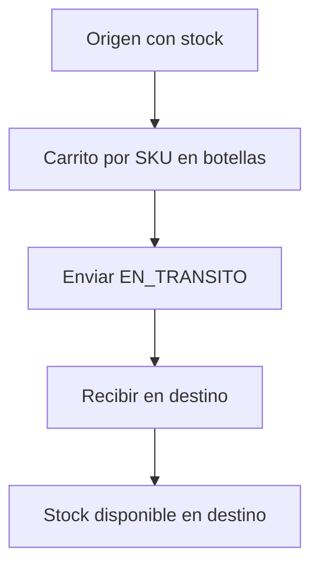
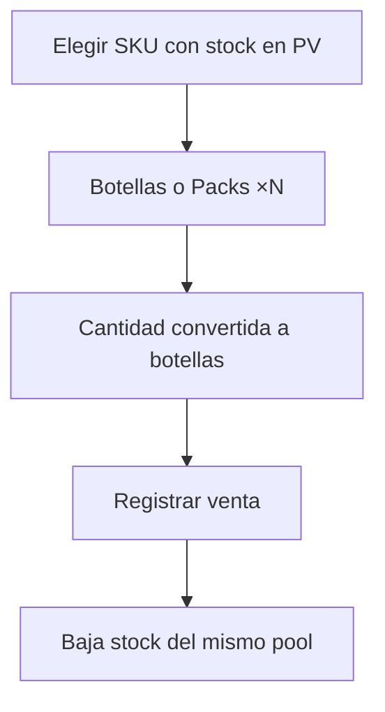
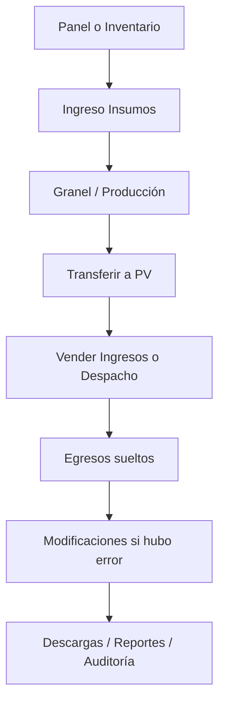

# Manual de uso detallado — Web ERP Bodega Santa María

**VIZIA S.A.C.** · Bodega Santa María · 2026  
**Versión del sistema web:** 1.0.0  
**Público:** personal de bodega, producción, punto de venta y administración  
**Última actualización:** 25 julio 2026

Este manual describe el uso día a día del **ERP web** en el navegador. Los nombres coinciden con el menú lateral.

**Secciones del menú:** Panel de control · Inventario · Producción · Comercial · Consulta · Administración.

---

## 1. Acceso e inicio de sesión

1. Abra la URL del sistema web entregada por VIZIA / Bodega Santa María.
2. Ingrese el **correo** y la **contraseña**.
3. Pulse **Iniciar sesión**.
4. Si los datos son correctos, verá el **Panel de control** y el menú lateral.

### Sesión

- La sesión se guarda en el navegador y se **renueva sola** mientras la pestaña esté abierta.
- Puede trabajar varios minutos u horas sin que lo eche por timeouts de red al renovar el token.
- En equipos compartidos: use **Configuración → Cerrar sesión** al terminar.

### Si no puede entrar

- Revise mayúsculas y minúsculas.
- Confirme que su usuario tiene **acceso web** activo.
- Use un navegador actualizado (Chrome, Edge, Firefox).

---

## 2. Unidades, SKU y packs (léalo una vez)

| Qué maneja | En pantalla puede elegir | En inventario queda |
|------------|--------------------------|---------------------|
| Producto terminado | Botella o pack ×6 / ×12… | Siempre **botellas** |
| Insumos / empaque | Su unidad (und, kg…) | Esa misma unidad |
| Granel | Litros | Litros en bodega de granel |

**Ejemplos**

- Elige Pack ×6 y escribe **10** → registra **60 botellas**.
- Elige Pack ×12 y escribe **5** → registra **60 botellas**.
- Elige Botellas y escribe **60** → registra **60 botellas**.

### Idea clave de ventas, despacho, transferencias y producción

- En el listado aparece **un solo ítem (SKU)** por producto, con stock en **botellas**.
- **No** aparecen filas separadas «Botella» y «Pack» como si fueran stocks distintos.
- Después elige **cómo contar**: botellas o packs (si hay varios tamaños, ×6 / ×12…).
- Puede **vender en botellas** aunque el stock se haya producido o ajustado pensando en packs.

**Almacenes habituales**

| Código | Uso |
|--------|-----|
| ALM_MP | Materias primas / insumos / empaque |
| ALM_GR | Granel (litros) |
| ALM_PT | Productos terminados (botellas) |
| PV_* | Puntos de venta |

---

## 3. Permisos

| Permiso / rol | Efecto en el web |
|---------------|------------------|
| Sin **acceso web** | No inicia sesión |
| Acceso web, sin **acceso ventas** | Inventario, producción, consulta; **sin** Ingresos, Despacho, Egresos ni Modificaciones |
| Acceso web + acceso ventas | También módulos comerciales |
| Rol **admin** | Además Materiales/SKUs, Maestros, Usuarios, Reportes, Clientes y proveedores |

En varios módulos hay un ícono de **ayuda** con un resumen de esa pantalla.

---

## 4. Panel de control

Vista gerencial del **mes** seleccionado.

1. Elija el **mes** en la barra superior.
2. Cambie de pestaña: Ejecutivo, Financiero, Operaciones, Comercial, Producción, Inventario.
3. Use el atajo a **Descargas** si necesita exportar.

Las ventas **anuladas** no suman al total. Zona horaria: **America/Lima**.

---

## 5. Inventario

Consulta stock y corrige saldos con conteo físico.

### Resumen

1. Abra **Inventario**.
2. Filtre por ubicación, tipo, categoría o solo ítems bajo mínimo.
3. Revise cantidades (PT en botellas).

### Ajuste / conteo

Funciona en **almacenes y puntos de venta** (no en tránsito).

1. Vaya a la pestaña **Ajuste / conteo** (o `/inventory?tab=ajuste`).
2. Elija **ubicación** (incluye `PV · …`).
3. Filtre por **tipo de material** (PT, GRANEL, INSUMO, EMPAQUE, MATERIAL o Todos).
4. Seleccione el **SKU / ítem** (un PT = una fila; incluye sin stock para sembrar).
5. Si es PT con pack: elija **Botellas** o **Packs** (y el tamaño ×N si hay varios).
6. Indique el **conteo físico**; el sistema calcula el delta.
7. Motive el movimiento y confirme → `AJUSTE_ING` o `AJUSTE_SAL`.

### Ejemplo

- En el PV faltan 3 botellas → conteo menor → ajuste de salida −3 con motivo «Inventario julio».
- Sembrar stock: ítem en 0 + conteo 24 botellas → ingreso +24.

---

## 6. Ingreso de insumos (compras)

Registra la **entrada de materiales** a bodega.

### Modo simple

1. Abra **Ingreso Insumos**.
2. Elija ubicación destino, ítem, cantidad y precio.
3. (Opcional) Proveedor / referencia.
4. Si aplica, active **Registrar egreso** (categoría y centro de costo).
5. Confirme. El stock queda disponible de inmediato.

### Modo documento

Varias líneas en un mismo documento de compra (útil con proveedor).

### Importante

- Con egreso: se crea un gasto origen **COMPRA**.
- Si se equivocó: **Modificaciones → Egresos** (editar o eliminar/anular compra).
- **No** vuelva a cargar el mismo gasto en el módulo Egresos.

### Ejemplo

- Compra 200 L de mosto a S/ 5,00 → stock +200; con egreso → gasto S/ 1 000.

---

## 7. Transferencias

Mueve stock entre ubicaciones. **PT se elige por SKU** (no por presentación duplicada).

1. Abra **Transferencias**.
2. Origen y destino distintos.
3. Agregue líneas:
   - **PT:** SKU → Botellas o Packs → cantidad (se mueve en **botellas**).
   - **Material:** ítem + cantidad en su unidad.
4. No mezcle PT y material en el mismo documento.
5. **Envíe**. Quedará en tránsito hasta **recibir** en destino.

### Ejemplo

- 5 packs ×12 (= 60 botellas) de ALM_PT al PV → confirme recepción en el PV.

---

## 8. Recetas

Define la fórmula (**BOM**) por **1 botella** de cada producto terminado.

- **Consulta:** usuarios con acceso al módulo.
- **Alta / edición:** normalmente **admin** (una receta por PT).
- Cantidades **por botella**, no por pack.
- Al producir: granel desde **ALM_GR**; el resto desde **ALM_MP**.

---

## 9. Granel

1. Abra **Granel**.
2. Elija ítem tipo granel, litros y observación (ej. tanque).
3. Confirme. Stock en **ALM_GR**.

### Ejemplo

- +500 L de «Vino Italia granel» → disponibles para envasado.

---

## 10. Producción (envasado)

### Crear orden

1. Abra **Producción**.
2. Elija el **SKU** a producir (no una fila pack y otra botella).
3. Planifique en **botellas** o **packs** (la orden guarda botellas).
4. Valide insumos si desea; guarde como **BORRADOR**.

### Completar

1. Valide insumos.
2. Complete con la cantidad **real en botellas**.
3. Se consumen insumos según receta y entran botellas a PT.
4. Puede **anular** solo borradores sin movimientos.

### Ejemplo

- Plan: Pack ×12 × 20 = **240 botellas** al completar.

---

## 11. Reempaque

Convierte un **ítem en otro** en la misma ubicación.

**No use reempaque** solo para «cambiar de Pack×6 a Pack×8»: el stock de PT ya está en botellas.

---

## 12. Ingresos (POS)

Requiere **acceso ventas**. Ventas en punto de venta.

### Reglas comunes

- Elija el **PV**; el stock mostrado es el de ese almacén.
- **Canal** desde el catálogo.
- **Cliente opcional**.
- Un producto por SKU; luego **botellas o packs** (×6 / ×12 si existen).
- Stock y descuento siempre en **botellas** (FIFO si no elige lote).
- La venta nueva queda con fecha de **hoy** (Lima). El selector de fecha sirve para el **historial**.

### Venta agrupada

1. Arme el carrito multi-línea.
2. Precio por botella (o según el formulario).
3. Registre.

### Venta rápida

Una línea: producto, empaque, cantidad, monto; confirme al instante.

### Ejemplo

- 2 packs ×12 = 24 botellas → baja **24 botellas** del PV.
- Tiene 60 botellas (aunque entraron como packs) → puede vender **15 botellas** sueltas sin problema.

Si hubo error de captura: **Modificaciones → Ingresos**.

---

## 13. Despacho

Venta rápida de **una línea** (mostrador / delivery). Misma lógica de stock que Ingresos.

1. PV, canal, cliente (opcional).
2. Producto (SKU) → botellas o packs → cantidad y precio.
3. Lote opcional (vacío = FIFO).
4. Registrar.

Para varias líneas use **Ingresos**.

---

## 14. Egresos

Gastos operativos que **no** nacen de una compra de insumos.

1. Fecha y centro de costo.
2. Agregue líneas: categoría, monto, proveedor/comprobante.
3. Registre el lote.
4. En el listado verá origen **Manual** o **Compra**.

Corrija o elimine en **Modificaciones → Egresos**.

---

## 15. Modificaciones

Corrige capturas erróneas **sin romper el inventario a ciegas**.

### Pestaña Ingresos (ventas)

1. Filtre por periodo (incluya anuladas si necesita).
2. Expanda líneas; edite **precios**, cliente, canal u observaciones.
3. **No** se cambian cantidades ni ubicación.
4. **Anular venta:** marca ANULADA y restituye stock (`AJUSTE_ING`).

### Pestaña Egresos

1. Filtre periodo.
2. **Manual:** editar o eliminar.
3. **Compra:**
   - **Editar:** corrige monto, descripción, proveedor, comprobante (**no** cambia cantidades de stock).
   - **Eliminar:** **anula la compra** (revierte ingreso si el lote aún tiene stock).
4. Si el lote ya se consumió, la anulación se rechaza con mensaje claro.

### Ejemplo

- Egreso «Compra: …» mal capturado → Eliminar en Modificaciones → stock del lote se revierte y desaparece el gasto.

---

## 16. Clientes y proveedores (admin)

1. Pestaña Proveedores o Clientes.
2. Nuevo / Editar.
3. **Eliminar** = baja lógica; puede **reactivar** y «Ver inactivos».
4. Solo activos aparecen en los desplegables de operaciones.

---

## 17. Auditoría

1. Pestaña **Historial:** filtros por fecha y tipo de movimiento.
2. Pestaña **Trazabilidad:** por número de lote.

Útil para COMPRA, VENTA, AJUSTE, PRODUCCIÓN, transferencias, etc.

---

## 18. Descargas

1. Elija **mes** y módulo (ventas, gastos, movimientos, etc.).
2. Descargue el archivo **Excel**.

---

## 19. Materiales / SKUs (admin)

- Crear o editar **ítems** (materiales, granel, PT).
- Crear o editar **presentaciones** (botella `cant_unidades=1`, pack ×6 / ×12…).
- Activar / desactivar (sin borrado físico).
- Crear un ítem o presentación **no** genera stock; el stock entra por compra, producción o ajuste.

---

## 20. Maestros (admin)

Pestañas típicas: canales de venta, empaques, categorías de gasto.

- Crear / editar; desactivar en lugar de borrar.
- Tras cambios importantes: **Configuración → recargar catálogos**.

---

## 21. Usuarios (admin)

**Solo lectura:** correo, rol y flags (`acceso_web`, `acceso_ventas`, etc.).

Altas y contraseñas se gestionan fuera de esta pantalla (Auth / VIZIA).

---

## 22. Reportes (admin)

1. Rango de fechas.
2. Filtros opcionales (PV, centro de costo).
3. Generar resumen de ventas, gastos, producción y compras.

---

## 23. Configuración

- Ver correo, rol y permisos de la sesión.
- Preferencias de la interfaz web.
- **Recargar catálogos** / limpiar caché local.
- **Cerrar sesión**.

---

## 24. Mensajes frecuentes

| Situación | Qué hacer |
|-----------|-----------|
| Sin permiso / módulo no visible | Pedir acceso ventas o rol admin |
| Catálogo vacío o desactualizado | Configuración → recargar catálogos |
| Sin stock en el PV | Transferir desde PT, producir o **ajustar** en el PV |
| No puedo vender botellas sueltas | Use modo **Botellas**; el stock ya está unificado |
| No se puede anular compra | El lote ya tiene salidas; ajustar inventario o revisar auditoría |
| Sesión expirada / login | Volver a autenticarse; verificar acceso web |
| Error al guardar | Anote el mensaje; reintente; si persiste, contacte soporte |

---

## 25. Flujo típico del día (web)

1. Revisar **Panel** del mes o **Inventario**.
2. **Ingreso Insumos** si hay compras.
3. **Granel** / **Producción** según campaña.
4. **Transferir** a puntos de venta.
5. **Vender** (Ingresos o Despacho) en botellas o packs.
6. Cargar **Egresos** sueltos (no los ya ligados a compra).
7. Corregir en **Modificaciones**.
8. Exportar en **Descargas** o revisar **Reportes** / **Auditoría**.

---

## 26. Buenas prácticas

- No registre la misma operación dos veces (web y app).
- Prefiera **Modificaciones** antes de «compensar» con otra venta/compra inventada.
- En PT piense siempre en **botellas**; el pack solo facilita el conteo.
- Puede ajustar stock **directo en el PV** cuando el conteo físico lo exija.
- En equipos compartidos, cierre sesión al terminar.
- Tras crear ítems o presentaciones nuevas, **recargue catálogos**.

---

## 27. Soporte

Si un módulo muestra error repetido:

1. Anote el **mensaje exacto**, el módulo y la hora.
2. Indique si usó web o app.
3. Contacte a la administración de Bodega Santa María / **VIZIA S.A.C.**

Documentación técnica: **Resumen técnico web** entregado junto a este manual.

---

*VIZIA S.A.C. · Bodega Santa María · Manual de usuario Web v1.0.0 · Julio 2026*
