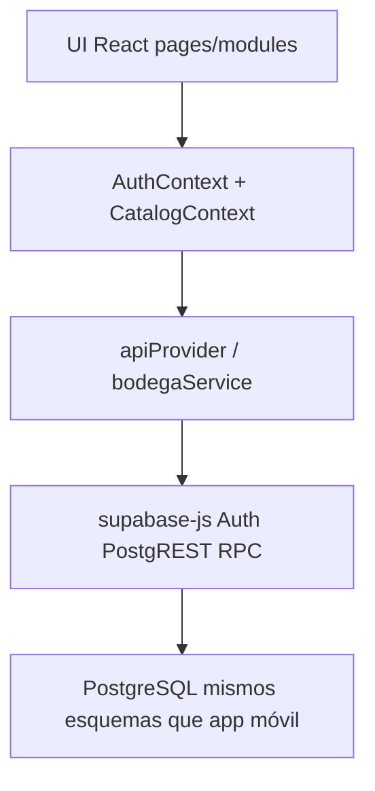
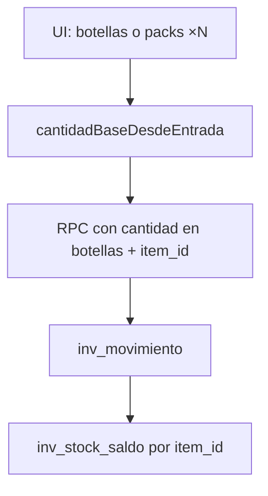

# Resumen técnico — Web ERP Bodega Santa María

**VIZIA S.A.C.** · Bodega Santa María · 2026  
**Versión del sistema web:** 1.0.0  
**Backend:** Supabase · proyecto `cztnnkxvwiwpeifqygta`  
**Repo:** `github.com/viziasac/web_bodegasantamaria`  
**Última actualización:** 25 julio 2026

Este documento resume la arquitectura del cliente web y su contrato con Supabase. El diccionario completo de tablas/triggers compartidos con la app móvil está en la documentación BD del repositorio de la app.

---

## 1. Arquitectura

| Capa | Rol |
|------|-----|
| `src/pages/modules/**` | Pantallas por módulo |
| `src/config/moduleRegistry.ts` | Menú, secciones, `adminOnly` |
| `src/config/erpContract.ts` | Nombres RPC y códigos de error |
| `src/services/api/*` | Lecturas PostgREST + escrituras RPC |
| `src/services/bodegaService.ts` | Orquestación (ventas, compras, ajustes, transferencias) |
| `src/utils/skuVenta.ts` | Agrupa presentaciones por `item_id` (1 SKU = 1 PT) |
| `src/utils/cantidadEmpaque.ts` | Pack × N → botellas antes del RPC |
| `src/components/CantidadEmpaqueToggle.tsx` | UI Botellas / Packs (×6, ×12…) |
| `src/context/AuthContext.tsx` | Sesión, refresh suave, gate `acceso_web` |

---

## 2. Stack

| Componente | Tecnología |
|------------|------------|
| Cliente | React 19 + TypeScript + Vite 6 |
| Routing | React Router (`BrowserRouter`) |
| Backend | Supabase (PostgreSQL, PostgREST, Auth) |
| Escrituras críticas | RPC `fn_*` (SECURITY DEFINER donde aplica) |
| Stock | `inv_movimiento` → trigger → `inv_stock_saldo` |
| Hosting | Cloudflare Pages (`dist/`, `_redirects` SPA) |
| Offline | No hay cola local; requiere red |

---

## 3. Principio de stock: botellas unificadas

### Modelo físico

`inv_stock_saldo` guarda **`(ubicacion_id, item_id, lote_id, cantidad)`**.  
**No** hay `presentacion_id` en el saldo: las presentaciones (`ma_presentacion.cant_unidades`) son metadata comercial.

| Contexto | Entrada UI | Persistencia |
|----------|------------|--------------|
| Producto terminado | 1 SKU por `ma_item` PT | Siempre **botellas** |
| Pack ×6 / ×12 | Factor del empaque | `cantidad × factor` → botellas **antes** del RPC |
| Insumos / empaque | Unidad del ítem | Misma unidad |
| Granel | Litros | Litros en `ALM_GR` |

**Ejemplo:** 10 × Pack×6 → movimiento de **60 botellas**, aunque el usuario haya elegido la presentación comercial pack.

### UI alineada al modelo

| Módulo | Comportamiento |
|--------|----------------|
| Ingresos / Despacho | 1 fila por SKU; toggle Botellas/Packs; stock = botellas del ítem |
| Transferencias | 1 fila por SKU; reserva stock por `item_id` en el carrito |
| Producción | Orden por SKU; `cant_planificada` / `cant_real` en botellas |
| Inventario (ajuste) | Almacenes + PV; filtro por tipo; PT una vez; conteo botellas o packs |
| Reempaque | Solo ítem→ítem distinto (no “flip” pack×6↔pack×8) |

Utilidades: `skusDesdeProductosPv`, `skusDesdeCatalogoPt`, `presentacionParaFactor`, `factoresPackSku`.

---

## 4. Auth y sesión

| Tema | Comportamiento |
|------|----------------|
| Persistencia | `localStorage` + `autoRefreshToken` |
| Gate web | Perfil / flags → `accesoWeb` |
| Refresh | En `TOKEN_REFRESHED`, fallos de red **no** fuerzan `signOut` |
| Visibilidad | Al volver a la pestaña: `refreshSession` suave |
| Cierre | Explícito en Configuración, o sesión inválida definitiva |

Flags: `acceso_web`, `acceso_app`, `acceso_ventas`, rol admin.

---

## 5. Maestros cliente / proveedor

| Tabla | Uso web | Notas |
|-------|---------|-------|
| `ma_cliente` | Ingresos, Despacho | `cliente_id` nullable |
| `ma_proveedor` | Compras, Egresos | Soft-delete `activo=false` |

Módulo **Clientes y proveedores** (admin): CRUD con baja lógica.

---

## 6. RPC principales (web)

| RPC | Uso |
|-----|-----|
| `fn_compra_registrar` | Entrada simple + lote |
| `fn_compra_registrar_con_gasto` | Compra + egreso opcional |
| `fn_compra_registrar_doc` | Compra documentada |
| `fn_compra_anular_desde_gasto` | Anula compra desde egreso COMPRA |
| `fn_gasto_registrar` / `actualizar` / `eliminar` | Egresos; eliminar COMPRA delega en anulación |
| `fn_granel_registrar` | Producción a granel |
| `fn_orden_completar` / `fn_anular_orden` | Órdenes de envasado |
| `fn_ajuste_registrar` | Ajuste / merma por `item_id` |
| `fn_venta_registrar` | Ingresos y Despacho (`ven_detalle` → movimiento VENTA) |
| `fn_venta_actualizar` / `fn_venta_anular` | Modificaciones de ventas |
| `fn_transferencia_registrar` / recepción | Traslado (stock al recibir) |
| `fn_reempaque_registrar` | Conversión ítem→ítem |
| `fn_resumen_stock_items` / reportes | Consultas |

Trigger de venta: `fn_ven_detalle_genera_movimiento` inserta `VENTA` con **`NEW.item_id` / `NEW.cantidad`** (botellas).

---

## 7. Módulos ↔ escritura

| Módulo | Escritura | Mecanismo |
|--------|-----------|-----------|
| Ingreso Insumos | Sí | Compra / compra+gasto / doc |
| Granel / Producción / Reempaque | Sí | RPC correspondientes |
| Inventario (ajuste) | Sí | `fn_ajuste_registrar` (PV y almacenes) |
| Ingresos / Despacho | Sí | `fn_venta_registrar` |
| Egresos | Sí | `fn_gasto_registrar` |
| Modificaciones | Sí | venta actualizar/anular; gasto + anular compra |
| Transferencias | Sí | registrar + recibir |
| Materiales / Maestros / Partners | Sí (admin) | PostgREST + RLS |
| Recetas | Lectura / escritura admin | BOM |
| Panel / Auditoría / Descargas / Reportes / Usuarios | Lectura | SELECT / RPC / XLSX |
| Configuración | Local + auth | Preferencias, signOut, refresh catálogo |

---

## 8. Despliegue (Cloudflare Pages)

| Campo | Valor |
|-------|--------|
| Build | `npm run build` |
| Output | `dist` |
| Node | 20 o 22 |
| SPA | `public/_redirects` → `/* /index.html 200` |
| Env | `VITE_SUPABASE_URL`, `VITE_SUPABASE_ANON_KEY` (anon JWT) |

Fallback embebido: `src/config/supabaseConfig.ts` si faltan variables.

---

## 9. Diferencias vs app móvil

| Tema | Web | App |
|------|-----|-----|
| Offline | No | Cola Hive |
| Panel gerencial | Sí | Limitado / reportes |
| Modificaciones | Módulo completo + anular compra | Según versión |
| Catálogos admin | Materiales, maestros, partners | Menos cobertura en UI |
| Package | SPA estático | Flutter Android |

Ambos escriben las mismas tablas vía el mismo contrato RPC.

---

## 10. Errores de negocio

Códigos en `ErpErrorCode` / `ErpErrorMessages`: `STOCK_INSUFICIENTE`, `ESTADO_INVALIDO`, `NO_ENCONTRADO`, `DATOS_INVALIDOS`, etc. La UI muestra mensajes vía `toUserMessage` / `friendlyDbError`.

---

## 11. Documentación de usuario

| Documento | Generación PDF |
|-----------|----------------|
| Manual + resúmenes MD en `docs/` | `python docs/build_pdf.py` |
| PDFs | `docs/pdf/*.pdf` |

El generador convierte diagramas **mermaid** en cajas de flujo y resalta bloques ASCII.

---

## 12. Documentos relacionados

| Documento | Uso |
|-----------|-----|
| Manual de uso web | Operación |
| Resumen general web | Gerencia |
| Documentación BD (repo app) | Tablas, triggers, flujos de stock |

Soporte técnico: **VIZIA S.A.C.** · Bodega Santa María.

---

*VIZIA S.A.C. · Bodega Santa María · Resumen técnico Web v1.0.0 · Julio 2026*
