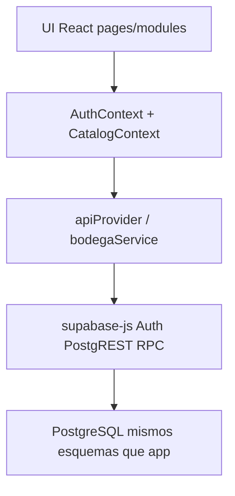
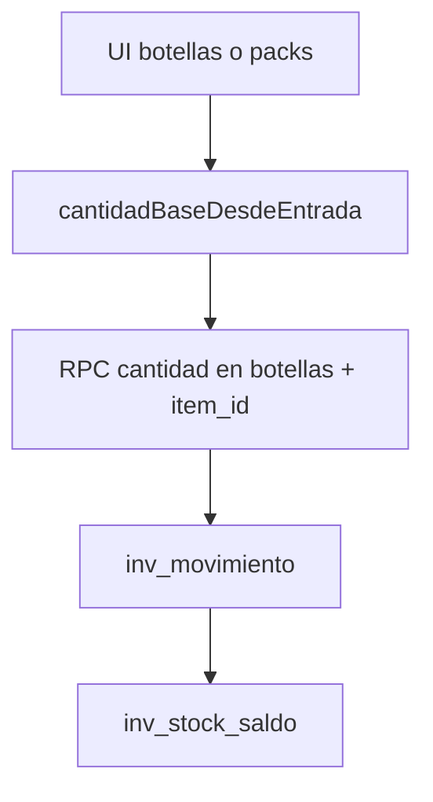

# Resumen técnico — Web ERP Bodega Santa María

**VIZIA S.A.C.** · Bodega Santa María · 2026  
**Versión del sistema web:** 1.0.0  
**Backend:** Supabase · proyecto `cztnnkxvwiwpeifqygta`  
**Repo:** `github.com/viziasac/web_bodegasantamaria`  
**Última actualización:** 25 julio 2026

Arquitectura del cliente web y contrato con Supabase. Diccionario completo de tablas/triggers: documentación BD del repo de la app móvil.

---

## 1. Arquitectura

| Capa | Rol |
|------|-----|
| `src/pages/modules/**` | Pantallas |
| `src/config/moduleRegistry.ts` | Menú / adminOnly |
| `src/config/erpContract.ts` | RPC y códigos de error |
| `src/services/api/*` | PostgREST + RPC |
| `src/services/bodegaService.ts` | Orquestación de flujos |
| `src/utils/skuVenta.ts` | 1 SKU = 1 `item_id` PT |
| `src/utils/cantidadEmpaque.ts` | Pack × N → botellas |
| `src/utils/ubicacionItemPolicy.ts` | Matriz almacén ↔ tipo |
| `src/components/CantidadEmpaqueToggle.tsx` | Botellas / Packs ×N |
| `src/context/AuthContext.tsx` | Sesión + `acceso_web` |

---

## 2. Stack

| Componente | Tecnología |
|------------|------------|
| Cliente | React 19 + TypeScript + Vite 6 |
| Routing | React Router (`BrowserRouter`) |
| Backend | Supabase (PostgreSQL, PostgREST, Auth) |
| Escrituras | RPC `fn_*` |
| Stock | `inv_movimiento` → trigger → `inv_stock_saldo` |
| Hosting | Cloudflare Pages |

---

## 3. Stock en botellas

`inv_stock_saldo`: `(ubicacion_id, item_id, lote_id, cantidad)` — **sin** `presentacion_id`.

Presentaciones (`cant_unidades`) son metadata comercial. Venta/despacho/ajuste PT: una fila por SKU.

---

## 4. Política almacén ↔ tipo

| Ubicación | Tipos permitidos |
|-----------|------------------|
| `ALM_GR` | `GRANEL` |
| `ALM_MP` | `INSUMO`, `EMPAQUE`, `MATERIAL` |
| `ALM_PT` / `PV_*` | `PT` |
| `TRANSIT` | Sin movimientos manuales |

### Web

`ubicacionItemPolicy.ts` filtra:

| Flujo | Ubicaciones | Ítems |
|-------|-------------|-------|
| Ingreso insumos | ALM_MP, ALM_GR | Según destino |
| Ajuste | Almacenes + PV (no TRANSIT) | Según ubicación + filtro tipo |
| Producción destino | Solo ALM_PT | SKU PT |
| Transferencias | Operativas (no TRANSIT) | Según origen; valida destino |
| Reempaque | ALM_MP, ALM_GR, ALM_PT | Ítem→ítem |
| Granel | Implícito ALM_GR | Solo GRANEL |

### Supabase

`fn_assert_item_ubicacion(item_id, ubicacion_id)` — script `scripts/sql/20260725_assert_item_ubicacion.sql`.

Integrada en:

- `fn_ajuste_registrar`
- `fn_compra_registrar`
- `fn_compra_registrar_doc`

(`fn_compra_registrar_con_gasto` delega en `fn_compra_registrar`.)

Error típico: `DATOS_INVALIDOS: En ALM_MP solo INSUMO, EMPAQUE o MATERIAL…`

---

## 5. Auth y sesión

| Tema | Comportamiento |
|------|----------------|
| Persistencia | `localStorage` + auto refresh |
| Gate | `acceso_web` |
| Refresh | Fallo de red no fuerza `signOut` |
| Cierre | Explícito o sesión inválida |

Flags: `acceso_web`, `acceso_app`, `acceso_ventas`, admin.

---

## 6. RPC principales

| RPC | Uso |
|-----|-----|
| `fn_compra_registrar*` | Compras (+ assert ubicación) |
| `fn_compra_anular_desde_gasto` | Anular compra desde egreso |
| `fn_gasto_*` | Egresos |
| `fn_granel_registrar` | Granel → ALM_GR |
| `fn_orden_completar` / `fn_anular_orden` | Envasado |
| `fn_ajuste_registrar` | Ajuste (+ assert) |
| `fn_venta_registrar` / actualizar / anular | Ventas |
| `fn_transferencia_registrar` + recepción | Traslados |
| `fn_reempaque_registrar` | Reempaque |
| `fn_assert_item_ubicacion` | Validación tipo↔almacén |

Trigger venta: movimiento `VENTA` por `item_id` / cantidad (botellas).

---

## 7. Módulos ↔ escritura

| Módulo | Escritura |
|--------|-----------|
| Ingreso / Granel / Producción / Reempaque | RPC |
| Inventario ajuste | `fn_ajuste_registrar` |
| Ingresos / Despacho | `fn_venta_registrar` |
| Egresos / Modificaciones | gasto + venta anular/actualizar |
| Transferencias | registrar + recibir |
| Materiales / Maestros / Partners | PostgREST + RLS (admin) |
| Panel / Auditoría / Descargas / Reportes | Lectura |

---

## 8. Despliegue

| Campo | Valor |
|-------|--------|
| Build | `npm run build` |
| Output | `dist` |
| SPA | `public/_redirects` → `/* /index.html 200` |
| Env | `VITE_SUPABASE_URL`, `VITE_SUPABASE_ANON_KEY` |

---

## 9. Documentación

| Artefacto | Generación |
|-----------|------------|
| MD en `docs/` | Fuente |
| PDF en `docs/pdf/` | `python docs/build_pdf.py` |

Mermaid → cajas de flujo en PDF.

---

## 10. Relacionados

Manual de uso · Resumen general · Documentación BD (repo app).

Soporte: **VIZIA S.A.C.**

---

*VIZIA S.A.C. · Bodega Santa María · Resumen técnico Web v1.0.0 · Julio 2026*
